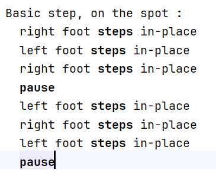
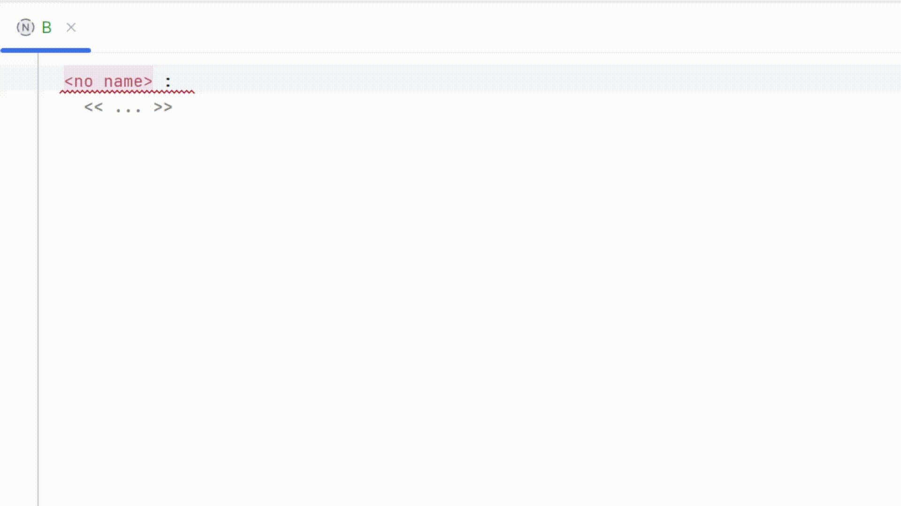
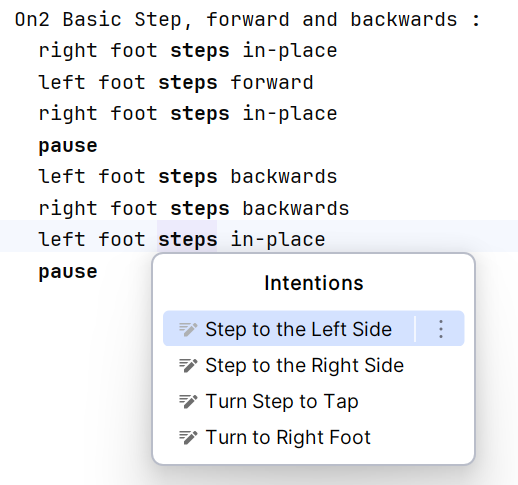
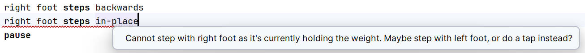

## SalsASTep

Language workbench for the "StepLang" Domain-Specific Language to express salsa (on1, on2, cuban) footwork patterns, written using JetBrains MPS.

### Showcase

To make a step sequence, you can alternate these fundamental actions:
- Step or tap in one direction
- Pause

For example, here's the definition for the On2 Basic Step on the spot:

And here is a demo in MPS:

Moreover, this language workbench provides several quickfixes to make the editing experience as smooth as possible:

Lastly, it also enforces some constraint rules:

### More details

The StepLang DSL comes with a set of assumptions and restrictions.

Assumptions:
- Both feet start from a centered position, and they are parallel to each other.

- Every action corresponds to one music count (ie. no syncopated movements are allowed).

- Every movement must refer to the relative position of the corresponding foot.
    - Example: we step forward with the left foot. To get back to the initial position, we must also step backwards with the left.

Constraints:
  - You cannot step with the same foot that holds your weight. For instance, it is not allowed to step two consecutive times with the left foot.
    - However, it is allowed to tap and then step with the same foot, as a tap does not change the weight.